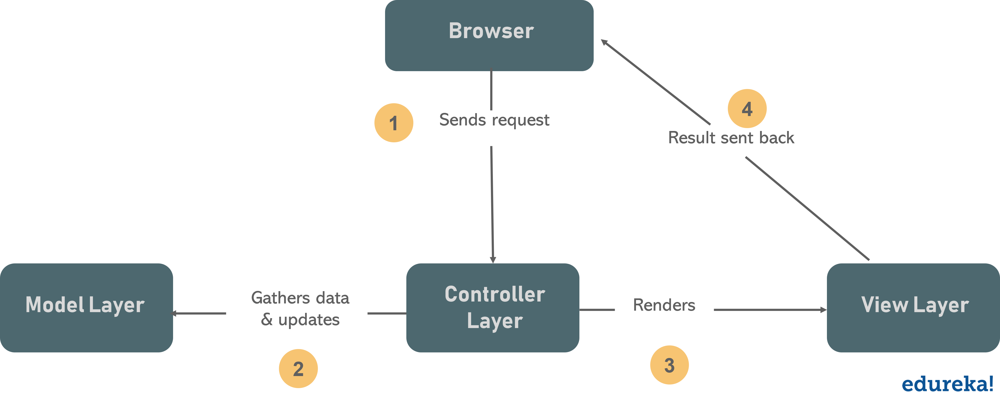

# Introduction

Laravel is a free PHP framework created by Taylor Otwell. Like many frameworks, Laravel provides a way of organizing and designing an application's souce code. If we take a look at its own organisation, we see that Laravel uses the "Model View Controller" (MVC). 

## Explanation of MVC

### Short introduction

The controller is the switcher who will activate the right switches to route the user to his destination. From the visitor's point of view, he requests a page from the controller and sends back a view according to certain parameters (does he have the authorization to access this page for example?).

### But why?

- To better organize its code strategically: the view only takes care of the display, the controller takes care of the user inputs and transmits them to the model.
- To respect a widely used convention
- To be able to work more efficiently in a team
- For event-driven communication between view, model and controller
- It allows a composite structure: the view will be composed of several elements superimposed on each other, generated by the interactions between the user and the application.

### So?

- Model, which defines the data structure and communicate with the database
- View, which handles the interface between the application and the users
- Controller, which manages data flow and communicate between the Model and the View

All these features make building an app in Laravel much faster than building from scratch. This makes Laravel a popular tool for rapid PHP development.

- [Next](b.composer.md)