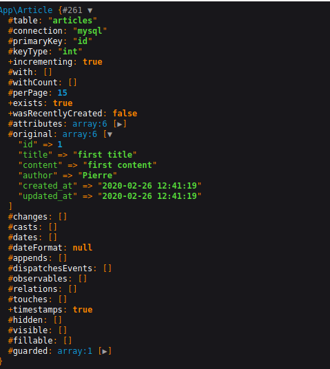

# # To be continued ... (2)

First, make sure you have at least more than one article in your table. 
Now, we are going to adapt your code in order to display the title, the content and the author of each article.

## ArticleController

```php
 public function index()
    {
        $articles = Article::get();
        
        return view('articles.index',compact('articles'));
    }
```

If we replace this line: `return view('articles.index',compact('articles'));` with this `dd($article)`, we see that we get a **collection**!

That means that the controller answers the model in order to get data from the database, now we are sure we can pass data to the view. Let us display this collection in our **articles.index** view.

```php
@foreach($articles as $article)
    <h2>{{ $article->title }} <strong>(Article created by {{ $article->author }})</strong></h2>
    <p>{{ $article->content }}</p>
@endforeach
```

**TIPS: don't forget to launch your app with a `php artisan serve`**

# Display a specific article with the id

Now we are going to select a specific article by its **id**. Don't forget to adapt the route if it is not done yet!

`Route::get('/article/{id},'ArticleController@show');`

```php
   public function show(Article $article,$id)
    {
        $article = Article::findOrFail($id);

        dd($article);
    }

```

If you go to this url `http://127.0.0.1:8000/article/1`, it is going to show you a collection



Right, now we can send this collection into the view **show**

```php
<h2>{{ $article->title }} <strong>(Article created by {{ $article->author }})</strong></h2>
<p>{{ $article->content }}</p>
```

#### Exercice (7)
1. Show all the restaurants (Display all the field)
2. Show a specific restaurant by its ID

- [Next](03.Exercice/../c.step3.md)